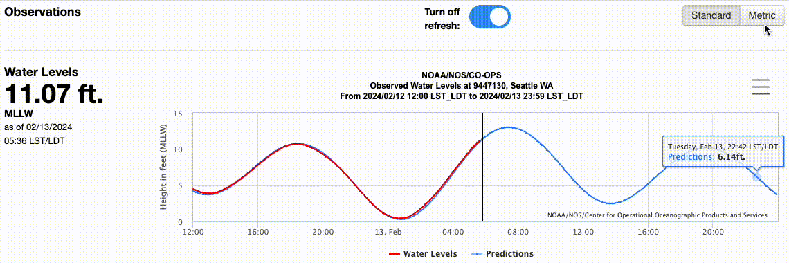

# Tarsal React Coding Challenge

Congratulations on making it to the coding challenge portion of the interview process!  This coding challenge was created by our front-end engineering team, and exercises some of the React technology and principles which we use in our codebase.

We recommend you to block ~2 hours of your time to complete it.

## Challenge:

Create a React application to visualize (graph) the Observed Water Levels from a NOAA data feed.  The application must allow HTML-form based filtering of:
1. Metric vs Standard Units
1. Start &amp; End Date Filters

The end result should be something similar to the graphs already produced by NOAA, but within a React framework.  We don’t expect pixel-perfect, in fact we encourage you to add a bit of your own “flair” and UI to the final result.

## Data Feed

To find a data feed:
1. Visit the [NOAA Water Level Station Selection](https://tidesandcurrents.noaa.gov/stations.html?type=Water+Levels) page and choose a station.
1. One the subsequent page, there is a form to play with the API.   Note the `Units` and `From/To` fields. 
1. To isolate the API endpoint you will be using, you can use the Developer Tools, or click the "Show Data Listing" button.  
   1. Then click on "Web Services"
   1. Copy the Water Levels JSON URL

The [NOAA API Documentation](https://api.tidesandcurrents.noaa.gov/api/prod/) may be of use to you as well.

## Conditions:

You must do/use the following:
1. Use the live dataset of Water Levels from NOAA as your REST-based JSON API.
1. Fetch the data asynchronously, but only 1 time 
1. Use React Functional Components
1. Use React Hooks
1. Use an application state manager  e.g. [data-client](https://github.com/reactive/data-client), [Redux](https://redux.js.org/), [Redux-Saga](https://redux-saga.js.org/), [React Context](https://react.dev/learn/passing-data-deeply-with-context), etc.
1. Use an off-the-shelf javascript visualization library.  e.g. [highcharts](https://highcharts.com), [amcharts](https://amcharts.com) , [d3js](https://d3js.org/), etc.
1. The data filters should be HTML form elements.  
   1. We know that most off-the-shelf graphing libraries will provide some filtering, but the filtering for units and dates should be driven from outside of the graphing libraries.

### Extra Credit:

1. No in-line CSS.  Use SCSS or styled-components instead

## Acceptance:

1. Code & application are visible online.  e.g. in [codesandbox](codesandbox.io) or [codepen](codepen.io), etc. 
   1. You can use this template as a starting point: [React - CodeSandbox](https://codesandbox.io/s/react-new) 
1. Data is loaded dynamically, but only 1 time, from NOAA
1. Interactive Charts allowing the ability to filter by units and from/to date controls
